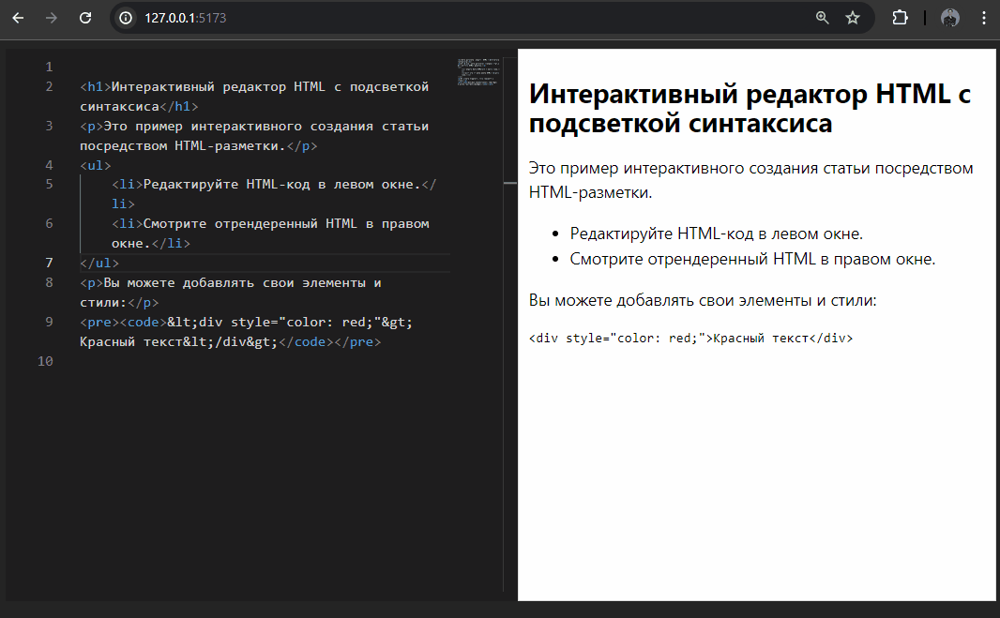

# Interactive Article Markup

This repository serves as a code sandbox for testing a prototype of interactive article editing. 
It features an editable HTML markup with syntax highlighting on the left, and a rendered view of the article with the necessary CSS styles on the right, exactly as it would appear to an end-user. This sandbox is an experimental example in the development of a blogging CMS for EditorialPerfection.



## Table of Contents

1. [Introduction](#introduction)
2. [Features](#features)
3. [Installation](#installation)
4. [Usage](#usage)
5. [License](#license)

## Introduction

The **Interactive Article Markup** project aims to enhance the reader's experience by adding interactive elements to articles. This template can be used by content creators, journalists, and developers to make their articles more engaging and informative.

## Features

- Interactive elements such as quizzes, charts, and infographics
- Easy-to-use markup language for adding interactivity
- Responsive design for mobile and desktop devices
- Lightweight and fast performance

## Installation

To get started with the project, follow these steps:

1. Clone the repository:
   ```
   git clone https://github.com/EditorialPerfection/interactive-article-markup.git
   ```

2. Navigate to the project directory:
   ```
   cd interactive-article-markup
   ```

3. Install the dependencies:
   ```
   npm install
   ```

## Usage

After installing the dependencies, you can start the development server:

```
npm run dev
```

This will start a local development server at `http://localhost:3000`, where you can view and edit your interactive articles.

To build the project for production, use:

```
npm run build
```

The output will be in the `dist` directory, ready to be deployed to your web server.


## License

This project is licensed under the MIT License. See the [LICENSE](LICENSE) file for more information.
